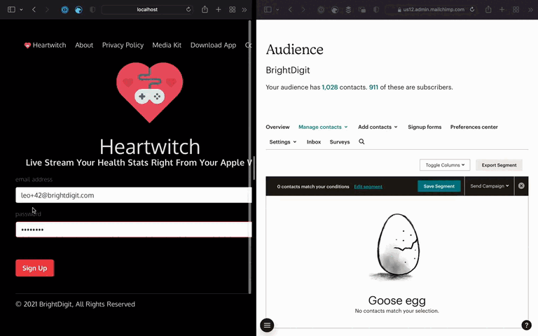

<p align="center">
	
</p>

<h1 align="center"> Spinetail </h1>

A Swift package for interfacing with your Mailchimp account, audiences, campaigns, and more. 

[](https://swift.org)
[](http://twitter.com/brightdigit)


[](https://app.bitrise.io/app/b2595eab70c25d1b)

[](https://swiftpackageindex.com/brightdigit/Spinetail)
[](https://swiftpackageindex.com/brightdigit/Spinetail)



<!--ts-->
# Table of Contents

* [🎬 Introduction](#-introduction)
   * [What's a <em>Spinetail</em>?](#whats-a-spinetail)
   * [How to create and send an email campaign](#how-to-create-and-send-an-email-campaign)
* [🎁 Features](#-features)
* [🏗 Installation](#-installation)
   * [Setting Up Your Mailchimp Client with Prch](#setting-up-your-mailchimp-client-with-prch)
* [💪 Usage](#-usage)
   * [🕊 _Prch_ Basics](#-prch-basics)
		 * [Closure-based Completion](#closure-based-completion)
		 * [Async/Await](#asyncawait)
		 * [Synchronous](#synchronous)
   * [👩 Audience List Members](#-audience-list-members)
	  * [Getting an Audience List Member](#getting-an-audience-list-member)
	  * [Adding new Audience List Members](#adding-new-audience-list-members)
	  * [Updating Existing Audience List Members](#updating-existing-audience-list-members)
	  * [Putting it together in Vapor](#putting-it-together-in-vapor)
   * [📩 Templates and Campaigns](#-templates-and-campaigns)
	  * [Pulling List of Campaigns](#pulling-list-of-campaigns)
	  * [Get Newsletter Content](#get-newsletter-content)
	  * [Creating a Template](#creating-a-template)
	  * [Send an Campaign Email to Our Audience List](#send-an-campaign-email-to-our-audience-list)
* [📞 Requests](#-requests)
   * [😁 Fully Supported](#-fully-supported)
	  * [Campaigns](#campaigns)
	  * [Lists](#lists)
	  * [Templates](#templates)
   * [😊 Testing Pending](#testing-pending)
	  * [Template Folders](#template-folders)
	  * [Search Campaigns](#search-campaigns)
	  * [Search Members](#search-members)
	  * [Reports](#reports)
	  * [Root](#root)
   * [😊 Pending Next Support](#-pending-next-support)
	  * [File Manager](#file-manager)
	  * [Batches](#batches)
	  * [Automations](#automations)
   * [😌 Remaining Requests](#-remaining-requests)
	  * [Activity Feed](#activity-feed)
	  * [Authorized Apps](#authorized-apps)
	  * [Connected Sites](#connected-sites)
	  * [Conversations](#conversations)
	  * [Customer Journeys](#customer-journeys)
	  * [Ecommerce Stores](#ecommerce-stores)
	  * [Facebook Ads](#facebook-ads)
	  * [Landing Pages](#landing-pages)
	  * [Verified Domains](#verified-domains)
* [🙏 Acknowledgments](#-acknowledgments)
* [📜 License](#-license)

<!--te-->

# 🎬 Introduction

**Spinetail** is a Swift package for interfacing with your Mailchimp account, audiences, campaigns, and more. 

Built on top of the code generated by [Swaggen by Yonas Kolb](https://github.com/yonaskolb/SwagGen) from [Mailchimp's OpenAPI Spec](https://github.com/mailchimp/mailchimp-client-lib-codegen) and optimized.

## What's a _Spinetail_?

A [Spinetail](https://en.wikipedia.org/wiki/Mottled_spinetail) is a type of Swift bird which shares it's habitat with chimps (such as the chimp in Mail<em>chimp</em>).

## How to create and send an email campaign

```swift
let listID : String = "[Your List ID]"
let mailchimpAPI = try Mailchimp.API(apiKey: "[ Your API Key : xxxxxxxxxxxxxxxxxxxxxxxxxxxxxxxx-us00 ]")
let client = Client(api: mailchimpAPI, session: URLSession.shared)

// create the campaign template
let templateRequest = Templates.PostTemplates.Request(body: .init(html: html, name: name))
let template = try await self.request(templateRequest)

// get the templateID
guard let templateID = template.id else { 
  return
}

// setup the email
let settings: Campaigns.PostCampaigns.Request.Body.Settings = .init(
  fromName: "Leo", 
  replyTo: "leo@brightdigit.com", 
  subjectLine: "Hello World - Test Email", 
  templateId: templateID
)

// setup the campaign
let body: Campaigns.PostCampaigns.Request.Body = .init(
  type: .regular, 
  contentType: .template, 
  recipients: .init(listId: listID), 
  settings: settings
)

let request = Campaigns.PostCampaigns.Request(body: body)
try await client.request(request)
```

# 🎁 Features 

Here's what's currently implemented with this library:

- [x] Pulling Your Current List of Campaigns
- [x] Send Email Campaigns to Your Lists 
- [x] Get Your Audience List
- [x] Add to Your Audience List
- [x] Updating Subscribers Tags and Interests

... and more

# 🏗 Installation

To integrate **Spinetail** into your project using SPM, specify it in your Package.swift file:

```swift    
let package = Package(
  ...
  dependencies: [
	.package(url: "https://github.com/brightdigit/Spinetail", from: "0.2.0")
  ],
  targets: [
	  .target(
		  name: "YourTarget",
		  dependencies: ["Spinetail", ...]),
	  ...
  ]
)
```

Spinetail uses `URLSession` for network communication via [Prch](https://github.com/brightdigit/Prch).

However if you are building a server-side application in Swift and wish to take advantage of SwiftNIO, then you'll want import [PrchNIO](https://github.com/brightdigit/PrchNIO) package as well:

```swift    
let package = Package(
  ...
  dependencies: [
	.package(url: "https://github.com/brightdigit/Spinetail", from: "0.2.0"),
	.package(url: "https://github.com/brightdigit/PrchNIO", from: "0.2.0")
  ],
  targets: [
	  .target(
		  name: "YourTarget",
		  dependencies: ["Spinetail", "PrchNIO", ...]),
	  ...
  ]
)
```

[PrchNIO](https://github.com/brightdigit/PrchNIO) adds support for `EventLoopFuture` and using the networking infrastructure already supplied by SwiftNIO.

If you are using [Vapor](https://vapor.codes), then you may also want to consider using [SpinetailVapor](https://github.com/brightdigit/SpinetailVapor) package:

```swift    
let package = Package(
  ...
  dependencies: [
	.package(url: "https://github.com/brightdigit/Spinetail", from: "0.2.0"),
	.package(url: "https://github.com/brightdigit/SpinetailVapor", from: "0.2.0")
  ],
  targets: [
	  .target(
		  name: "YourTarget",
		  dependencies: ["Spinetail", "SpinetailVapor", ...]),
	  ...
  ]
)
```

The [SpinetailVapor](https://github.com/brightdigit/SpinetailVapor) package adds helper properties and methods to help with setting up and accessing the `Prch.Client`.

## Setting Up Your Mailchimp Client with Prch

In order to get started with the Mailchimp API, [make sure you have created an API key](https://mailchimp.com/developer/marketing/guides/quick-start/#generate-your-api-key). Typically the API key looks something like this:

```
xxxxxxxxxxxxxxxxxxxxxxxxxxxxxxxx-us00
```

Once you have that, decide what you'll be using for your session depending on your platform:

* `URLSession` - iOS, tvOS, watchOS, macOS _from [Prch](https://github.com/brightdigit/Prch)_
* `AsyncHTTPClient` - Linux/Server _from [PrchNIO](https://github.com/brightdigit/PrchNIO)_
* `Vapor.Client` - Vapor _from [PrchVapor](https://github.com/brightdigit/PrchVapor)_

Here's an example for setting up a client for Mailchimp on a standard Apple platform app:
 
```swift
let api = Mailchimp,API(apiKey: "")
let client = Client(api: api, session: URLSession.shared)
```

If you are using **Vapor** then you'll want to configure your client inside your application configuration:

```swift
app.mailchimp.configure(withAPIKey: "")
```

... then you'll have access to it throughout your application and in your requests:

```swift
request.mailchimp.client.request(...)
application.mailchimp.client.request(...)
```

Now that we have setup the client, we'll be using let's begin to access the Mailchimp API.

# 💪 Usage 

## 🕊 _Prch_ Basics

To make a request via `Prch`, we have three options using our `client`:

* closure-based completion calls
* async/await 
* synchronous calls

#### Closure-based Completion

```swift
client.request(request) { result in
  switch result {
  case let .success(member):
	  // Successful Retrieval
	break
  case let .defaultResponse(statusCode, response):
	  // Non-2xx Response (ex. 404 member not found)
	break
  case let .failure(error):
	  // Other Errors (ex. networking, decoding or encoding JSON...)
	break
  }
}
```


#### Async/Await 

```swift
do {
  // Successful Retrieval
  let member = try await client.request(request)
} catch let error as ClientResponseResult<Lists.GetListsIdMembersId.Response>.FailedResponseError {
  // Non-2xx Response (ex. 404 member not found)
} catch  {
  // Other Errors (ex. networking, decoding or encoding JSON...)
}
```

#### Synchronous

```swift
do {
  // Successful Retrieval
  let member = try client.requestSync(request)
} catch let error as ClientResponseResult<Lists.GetListsIdMembersId.Response>.FailedResponseError {
  // Non-2xx Response (ex. 404 member not found)
} catch  {
  // Other Errors (ex. networking, decoding or encoding JSON...)
}
```

In each case there are possible results:

* The call was successful
* The call failed but the response was valid such as a 4xx status code
* The call failed due to an internal error (ex. decoding, encoding, networking, etc...)

Let's start with an example using audience member lists.

## 👩 Audience List Members

### Getting an Audience List Member

According to [the documentation for the Mailchimp API](https://mailchimp.com/developer/marketing/api/list-members/get-member-info/), we can get a member of our audience list based on their _subscriber_hash_.
This is described as:

> The MD5 hash of the lowercase version of the list member's email address. This endpoint also accepts a list member's email address or contact_id.

The means we can use:
* MD5 hash of the lowercase version of the list member's email address _but also_
* email address or
* `contact_id`

In our case, we'll be using an email address to see if we have someone subscribed. 
Additionally we need our audience's `listID` which is found on the audience settings page.


With that email address, we can create a `Request`:

```swift
import Spinetail 

let api = MailchimpAPI(apiKey: "")
let client = Client(api: api, session: URLSession.shared)
let request = Lists.GetListsIdMembersId.Request(listId: listId, subscriberHash: emailAddress)
```

As previously noted there are three ways to execute a call. In this case, let's use the synchronous call:

```swift
do {
  // Successful Retrieval
  let member = try client.requestSync(request)
} catch let error as ClientResponseResult<Lists.GetListsIdMembersId.Response>.FailedResponseError {
  // Non-2xx Response (ex. 404 member not found)
} catch  {
  // Other Errors (ex. networking, decoding or encoding JSON...)
}
```

This is a good example of where we'd want to handle a `404`. If the member is found, we may need to just update them, otherwise we want go ahead and add that subscriber.

### Adding new Audience List Members

To [add a new audience member](https://mailchimp.com/developer/marketing/api/list-members/add-member-to-list/) we need to create a `Lists.PostListsIdMembers.Request`:

```swift
let request = Lists.PostListsIdMembers.Request(
  listId: listID, 
  body: .init(
    emailAddress: emailAddress, 
	status: .subscribed, 
	timestampOpt: .init(), 
	timestampSignup: .init()
  )
)
```

Now that we have a request let's use the completion handler call for adding a new member:

```swift
client.request(request) { result in
  switch result {
  case let .success(newMember):
	  // Successful Adding
	break
  case let .defaultResponse(statusCode, response):
	  // Non-2xx Response
	break
  case let .failure(error):
	  // Other Errors (ex. networking, decoding or encoding JSON...)
	break
  }
}
```

### Updating Existing Audience List Members

Let's say our attempt to find an existing subscriber member succeeds but we need to [update the member's interests](https://mailchimp.com/developer/marketing/api/list-members/update-list-member/). 
We can get `subscriberHash` from our found member and the [`interestID` can be queried](https://mailchimp.com/developer/marketing/api/interests/list-interests-in-category/). 

```swift
// get the subscriber hash id
let subscriberHash = member.id
let patch = Lists.PatchListsIdMembersId.Request(
  body: .init(
    emailAddress: emailAddress,
	emailType: nil, 
	interests: [interestID: true] 
  ), 
  options: .init(
    listId: Self.listID, 
	subscriberHash: subscriberHash
  )
)
```

### Putting it together in Vapor

Here's an example in [Vapor](https://vapor.codes) using [Model Middleware provided by Fluent](https://docs.vapor.codes/4.0/fluent/model/#lifecycle):

```swift
import Fluent
import Prch
import PrchVapor
import Spinetail
import Vapor

struct MailchimpMiddleware: ModelMiddleware {
  // our client created during server initialization
  let client: Prch.Client<PrchVapor.SessionClient, Spinetail.Mailchimp.API>
  
  // the list id
  let listID: String
  
  // the interest id 
  let interestID : String

  func upsertSubscriptionForUser(_ user: User, withEventLoop eventLoop: EventLoop) -> EventLoopFuture<Void> {
	let memberRequest = Lists.GetListsIdMembersId.Request(listId: listID, subscriberHash: user.email)
	// find the subscription member
	return client.request(memberRequest).flatMapThrowing { response -> in
	  switch response {
	  case .defaultResponse(statusCode: 404, _):
		return nil
	  case let .status200(member):
		return member
	  default:
		throw ClientError.invalidResponse
	  }

	}.flatMap { member in
	  // if the subscriber already exists and has the interest id, don't do anything
	  if member?.interests?[self.interestID] == true {
		return eventLoop.future()
	  // if the subscriber already exists but doesn't have the interest id
	  } else if let subscriberHash = member?.id {
	  	// update the subscriber
		let patch = Lists.PatchListsIdMembersId.Request(body: .init(emailAddress: user.email, emailType: nil, interests: [self.interestID: true]), options: Lists.PatchListsIdMembersId.Request.Options(listId: self.listID, subscriberHash: subscriberHash))
		// transform to `Void` on success
		return client.request(patch).success()
	  // if the subscriber doesn't already exists
	  } else {
	  	// update the subscriber add them
		let post = Lists.PostListsIdMembers.Request(listId: self.listID, body: .init(emailAddress: user.email, status: Lists.PostListsIdMembers.Request.Body.Status.subscribed, interests: [self.interestID: true], timestampOpt: .init(), timestampSignup: .init()))
		// transform to `Void` on success
		return client.request(post).success()
	  }
	}
  }

  // after adding the row to the db, add the user to our subscription list with the interest id
  func create(model: User, on db: Database, next: AnyModelResponder) -> EventLoopFuture<Void> {
	next.create(model, on: db).transform(to: model).flatMap { user in
	  self.upsertSubscriptionForUser(user, withEventLoop: db.eventLoop)
	}
  }
}
```

Now that we have an example dealing with managing members, let's look at how to get a list of campaigns and email our subscribers in Swift.

## 📩 Templates and Campaigns

With newsletters there are [campaigns](https://mailchimp.com/developer/marketing/api/campaigns/) and [templates](https://mailchimp.com/developer/marketing/api/templates/). 
_Campaigns_ are how you send emails to your Mailchimp list. A _template_ is an HTML file used to create the layout and basic design for a campaign.
Before creating our own campaign and template, let's look at how to pull a list of campaigns.

### Pulling List of Campaigns

On the BrightDigit web site, I want to link to each newsletter that's sent out. To do this you just need the `listID` again.
We'll be pulling up to 1000 sent campaigns sorted from last sent to first sent:

```swift
let request = Campaigns.GetCampaigns.Request(
  count: 1000, 
  status: .sent, 
  listId: listID, 
  sortField: .sendTime, 
  sortDir: .desc
)
let response = try self.requestSync(request)
let campaigns = response.campaigns ?? []
```

To get the content we to grab it based on each campaign's `campaignID`.

### Get Newsletter Content

Before grabbing the content, we need to grab the `campaignID` from the campaign:

```swift
let campaign : Campaigns.GetCampaigns.Response.Status200.Campaigns
let html: String

guard let campaignID = campaign.id else {
  return
}

html = try self.htmlFromCampaign(withID: campaignProperties.campaignID)
```

### Creating a Template

To actually send we need to create an [template](https://mailchimp.com/developer/marketing/api/templates/) using [the
`POST` request](https://mailchimp.com/developer/marketing/api/templates/add-template/). Here's an example with async and await:

```swift
let templateName = "Example Email"
let templateHTML = "<strong>Hello World</strong>"
let templateRequest = Templates.PostTemplates.Request(body: .init(html: templateHTML, name: templateName))
let template = try await client.request(templateRequest)
```

Let's use the template to create a campaign and send it.


### Send an Campaign Email to Our Audience List

```swift
// make sure to get the templateID
guard let templateID = template.id else {
  return
}

// set the email settings
let settings: Campaigns.PostCampaigns.Request.Body.Settings = .init(
  fromName: "Leo", 
  replyTo: "leo@brightdigit.com", 
  subjectLine: "Hello World - Test Email", 
  templateId: templateID
)
// set the type and list you're sending to
let body: Campaigns.PostCampaigns.Request.Body = .init(
  type: .regular, 
  contentType: .template, 
  recipients: .init(listId: listID), 
  settings: settings
)
let request = Campaigns.PostCampaigns.Request(body: body)
await client.request(request)
```

# 📞 Requests

List of APIs and the status of their support. 
If you have any requests feel free to [submit an issue](https://github.com/brightdigit/Spinetail/issues/new/choose) or [pull-request](https://github.com/brightdigit/Spinetail/compare) to improve current support.
For more information on [the Mailchimp Marketing API, checkout their API documentation.](https://mailchimp.com/developer/marketing/)

## 😁 Fully Supported

Due to the limitation of existing 32-bit watchOS devices, the library need to exclude certain APIs to limit size. 
Therefore these sets of APIs are available on all operating systems and platforms including watchOS.

### Campaigns

| Request                                             | Tested | Documented | watchOS |
| --------------------------------------------------- | ------ | ---------- | ------- |
| DeleteCampaignsId                                   |        |            | ✅       |
| DeleteCampaignsIdFeedbackId                         |        |            | ✅       |
| GetCampaigns                                        |        |            | ✅       |
| GetCampaignsId                                      |        |            | ✅       |
| GetCampaignsIdContent                               |        | ✅          | ✅       |
| GetCampaignsIdFeedback                              |        |            | ✅       |
| GetCampaignsIdFeedbackId                            |        |            | ✅       |
| GetCampaignsIdSendChecklist                         |        |            | ✅       |
| PatchCampaignsId                                    |        |            | ✅       |
| PatchCampaignsIdFeedbackId                          |        |            | ✅       |
| PostCampaigns                                       | ✅      | ✅          | ✅       |
| PostCampaignsIdActionsCancelSend                    |        |            | ✅       |
| PostCampaignsIdActionsCreateResend                  |        |            | ✅       |
| PostCampaignsIdActionsPause                         |        |            | ✅       |
| PostCampaignsIdActionsReplicate                     |        |            | ✅       |
| PostCampaignsIdActionsResume                        |        |            | ✅       |
| PostCampaignsIdActionsSchedule                      |        |            | ✅       |
| PostCampaignsIdActionsSend                          |        |            | ✅       |
| PostCampaignsIdActionsTest                          |        |            | ✅       |
| PostCampaignsIdActionsUnschedule                    |        |            | ✅       |
| PostCampaignsIdFeedback                             |        |            | ✅       |
| PutCampaignsIdContent                               |        |            | ✅       |

### Lists


| Request                                             | Tested | Documented | watchOS |
| --------------------------------------------------- | ------ | ---------- | ------- |
| DeleteListsId                                       |        |            | ✅       |
| DeleteListsIdInterestCategoriesId                   |        |            | ✅       |
| DeleteListsIdInterestCategoriesIdInterestsId        |        |            | ✅       |
| DeleteListsIdMembersId                              |        |            | ✅       |
| DeleteListsIdMembersIdNotesId                       |        |            | ✅       |
| DeleteListsIdMergeFieldsId                          |        |            | ✅       |
| DeleteListsIdSegmentsId                             |        |            | ✅       |
| DeleteListsIdSegmentsIdMembersId                    |        |            | ✅       |
| DeleteListsIdWebhooksId                             |        |            | ✅       |
| GetListMemberTags                                   |        |            | ✅       |
| GetLists                                            |        |            | ✅       |
| GetListsId                                          |        |            | ✅       |
| GetListsIdAbuseReports                              |        |            | ✅       |
| GetListsIdAbuseReportsId                            |        |            | ✅       |
| GetListsIdActivity                                  |        |            | ✅       |
| GetListsIdClients                                   |        |            | ✅       |
| GetListsIdGrowthHistory                             |        |            | ✅       |
| GetListsIdGrowthHistoryId                           |        |            | ✅       |
| GetListsIdInterestCategories                        |        |            | ✅       |
| GetListsIdInterestCategoriesId                      |        |            | ✅       |
| GetListsIdInterestCategoriesIdInterests             |        |            | ✅       |
| GetListsIdInterestCategoriesIdInterestsId           |        |            | ✅       |
| GetListsIdLocations                                 |        |            | ✅       |
| GetListsIdMembers                                   |        |            | ✅       |
| GetListsIdMembersId                                 | ✅      | ✅          | ✅       |
| GetListsIdMembersIdActivity                         |        |            | ✅       |
| GetListsIdMembersIdActivityFeed                     |        |            | ✅       |
| GetListsIdMembersIdEvents                           |        |            | ✅       |
| GetListsIdMembersIdGoals                            |        |            | ✅       |
| GetListsIdMembersIdNotes                            |        |            | ✅       |
| GetListsIdMembersIdNotesId                          |        |            | ✅       |
| GetListsIdMergeFields                               |        |            | ✅       |
| GetListsIdMergeFieldsId                             |        |            | ✅       |
| GetListsIdSegmentsId                                |        |            | ✅       |
| GetListsIdSegmentsIdMembers                         |        |            | ✅       |
| GetListsIdSignupForms                               |        |            | ✅       |
| GetListsIdWebhooks                                  |        |            | ✅       |
| GetListsIdWebhooksId                                |        |            | ✅       |
| PatchListsId                                        |        |            | ✅       |
| PatchListsIdInterestCategoriesId                    |        |            | ✅       |
| PatchListsIdInterestCategoriesIdInterestsId         |        |            | ✅       |
| PatchListsIdMembersId                               | ✅      | ✅          | ✅       |
| PatchListsIdMembersIdNotesId                        |        |            | ✅       |
| PatchListsIdMergeFieldsId                           |        |            | ✅       |
| PatchListsIdSegmentsId                              |        |            | ✅       |
| PatchListsIdWebhooksId                              |        |            | ✅       |
| PostListMemberEvents                                |        |            | ✅       |
| PostListMemberTags                                  |        |            | ✅       |
| PostLists                                           |        |            | ✅       |
| PostListsId                                         |        |            | ✅       |
| PostListsIdInterestCategories                       |        |            | ✅       |
| PostListsIdInterestCategoriesIdInterests            |        |            | ✅       |
| PostListsIdMembers                                  | ✅      | ✅          | ✅       |
| PostListsIdMembersHashActionsDeletePermanent        |        |            | ✅       |
| PostListsIdMembersIdNotes                           |        |            | ✅       |
| PostListsIdMergeFields                              |        |            | ✅       |
| PostListsIdSegments                                 |        |            | ✅       |
| PostListsIdSegmentsId                               |        |            | ✅       |
| PostListsIdSegmentsIdMembers                        |        |            | ✅       |
| PostListsIdSignupForms                              |        |            | ✅       |
| PostListsIdWebhooks                                 |        |            | ✅       |
| PreviewASegment                                     |        |            | ✅       |
| PutListsIdMembersId                                 |        |            | ✅       |
| SearchTagsByName                                    |        |            | ✅       |

### Templates

| Request                                             | Tested | Documented | watchOS |
| --------------------------------------------------- | ------ | ---------- | ------- |
| GetTemplates                                        |        |            | ✅       |
| GetTemplatesId                                      |        |            | ✅       |
| GetTemplatesIdDefaultContent                        |        |            | ✅       |
| PatchTemplatesId                                    |        |            | ✅       |
| PostTemplates                                       | ✅      | ✅          | ✅       |

## Testing Pending


| Request                                             | Tested | Documented | watchOS |
| --------------------------------------------------- | ------ | ---------- | ------- |
| DeleteCampaignFoldersId                             |        |            | ✅      |
| GetCampaignFolders                                  |        |            | ✅      |
| GetCampaignFoldersId                                |        |            | ✅      |
| PatchCampaignFoldersId                              |        |            | ✅      |
| PostCampaignFolders                                 |        |            | ✅      |

### Template Folders

| Request                                             | Tested | Documented | watchOS |
| --------------------------------------------------- | ------ | ---------- | ------- |
| DeleteTemplateFoldersId                             |        |            | ✅       |
| GetTemplateFolders                                  |        |            | ✅       |
| GetTemplateFoldersId                                |        |            | ✅       |
| PatchTemplateFoldersId                              |        |            | ✅       |
| PostTemplateFolders                                 |        |            | ✅       |
| DeleteTemplatesId                                   |        |            | ✅       |

### Search Campaigns

| Request                                             | Tested | Documented | watchOS |
| --------------------------------------------------- | ------ | ---------- | ------- |
| GetSearchCampaigns                                  |        |            | ✅       |

### Search Members

| Request                                             | Tested | Documented | watchOS |
| --------------------------------------------------- | ------ | ---------- | ------- |
| GetSearchMembers                                    |        |            | ✅       |

### Reports

| Request                                             | Tested | Documented | watchOS |
| --------------------------------------------------- | ------ | ---------- | ------- |
| GetReports                                          |        |            | ✅       |
| GetReportsId                                        |        |            | ✅       |
| GetReportsIdAbuseReportsId                          |        |            | ✅       |
| GetReportsIdAbuseReportsIdId                        |        |            | ✅       |
| GetReportsIdAdvice                                  |        |            | ✅       |
| GetReportsIdClickDetails                            |        |            | ✅       |
| GetReportsIdClickDetailsId                          |        |            | ✅       |
| GetReportsIdClickDetailsIdMembers                   |        |            | ✅       |
| GetReportsIdClickDetailsIdMembersId                 |        |            | ✅       |
| GetReportsIdDomainPerformance                       |        |            | ✅       |
| GetReportsIdEcommerceProductActivity                |        |            | ✅       |
| GetReportsIdEepurl                                  |        |            | ✅       |
| GetReportsIdEmailActivity                           |        |            | ✅       |
| GetReportsIdEmailActivityId                         |        |            | ✅       |
| GetReportsIdLocations                               |        |            | ✅       |
| GetReportsIdOpenDetails                             |        |            | ✅       |
| GetReportsIdOpenDetailsIdMembersId                  |        |            | ✅       |
| GetReportsIdSentTo                                  |        |            | ✅       |
| GetReportsIdSentToId                                |        |            | ✅       |
| GetReportsIdSubReportsId                            |        |            | ✅       |
| GetReportsIdUnsubscribed                            |        |            | ✅       |
| GetReportsIdUnsubscribedId                          |        |            | ✅       |

### Root

| Request                                             | Tested | Documented | watchOS |
| --------------------------------------------------- | ------ | ---------- | ------- |
| GetRoot                                             |        |            | ✅       |

## 😊 Pending Next Support

These are the next set of API for which migrating to watchOS is desired as well as more robust testing and documentation.
If you have any requests feel free to [submit an issue](https://github.com/brightdigit/Spinetail/issues/new/choose) or [pull-request](https://github.com/brightdigit/Spinetail/compare) to improve current support.

### File Manager

| Request                                             | Tested | Documented | watchOS |
| --------------------------------------------------- | ------ | ---------- | ------- |
| DeleteFileManagerFilesId                            |        |            |         |
| DeleteFileManagerFoldersId                          |        |            |         |
| GetFileManagerFiles                                 |        |            |         |
| GetFileManagerFilesId                               |        |            |         |
| GetFileManagerFolders                               |        |            |         |
| GetFileManagerFoldersId                             |        |            |         |
| PatchFileManagerFilesId                             |        |            |         |
| PatchFileManagerFoldersId                           |        |            |         |
| PostFileManagerFiles                                |        |            |         |
| PostFileManagerFolders                              |        |            |         |

### Batches

| Request                                             | Tested | Documented | watchOS |
| --------------------------------------------------- | ------ | ---------- | ------- |
| DeleteBatchesId                                     |        |            |         |
| GetBatches                                          |        |            |         |
| GetBatchesId                                        |        |            |         |
| PostBatches                                         |        |            |         |
| DeleteBatchWebhookId                                |        |            |         |
| GetBatchWebhook                                     |        |            |         |
| GetBatchWebhooks                                    |        |            |         |
| PatchBatchWebhooks                                  |        |            |         |
| PostBatchWebhooks                                   |        |            |         |

### Automations

| Request                                             | Tested | Documented | watchOS |
| --------------------------------------------------- | ------ | ---------- | ------- |
| ArchiveAutomations                                  |        |            |         |
| DeleteAutomationsIdEmailsId                         |        |            |         |
| GetAutomations                                      |        |            |         |
| GetAutomationsId                                    |        |            |         |
| GetAutomationsIdEmails                              |        |            |         |
| GetAutomationsIdEmailsId                            |        |            |         |
| GetAutomationsIdEmailsIdQueue                       |        |            |         |
| GetAutomationsIdEmailsIdQueueId                     |        |            |         |
| GetAutomationsIdRemovedSubscribers                  |        |            |         |
| GetAutomationsIdRemovedSubscribersId                |        |            |         |
| PatchAutomationEmailWorkflowId                      |        |            |         |
| PostAutomations                                     |        |            |         |
| PostAutomationsIdActionsPauseAllEmails              |        |            |         |
| PostAutomationsIdActionsStartAllEmails              |        |            |         |
| PostAutomationsIdEmailsIdActionsPause               |        |            |         |
| PostAutomationsIdEmailsIdActionsStart               |        |            |         |
| PostAutomationsIdEmailsIdQueue                      |        |            |         |
| PostAutomationsIdRemovedSubscribers                 |        |            |         |

## 😌 Remaining Requests

These are the least priority set of API for which migrating to watchOS as well as robust testing and documentation have been prioritized.
If you have any requests feel free to [submit an issue](https://github.com/brightdigit/Spinetail/issues/new/choose) or [pull-request](https://github.com/brightdigit/Spinetail/compare) to improve current support.


### Activity Feed

| Request                                             | Tested | Documented | watchOS |
| --------------------------------------------------- | ------ | ---------- | ------- |
| GetActivityFeedChimpChatter                         |        |            |         |

### Authorized Apps

| Request                                             | Tested | Documented | watchOS |
| --------------------------------------------------- | ------ | ---------- | ------- |
| GetAuthorizedApps                                   |        |            |         |
| GetAuthorizedAppsId                                 |        |            |         |

### Connected Sites

| Request                                             | Tested | Documented | watchOS |
| --------------------------------------------------- | ------ | ---------- | ------- |
| DeleteConnectedSitesId                              |        |            |         |
| GetConnectedSites                                   |        |            |         |
| GetConnectedSitesId                                 |        |            |         |
| PostConnectedSites                                  |        |            |         |
| PostConnectedSitesIdActionsVerifyScriptInstallation |        |            |         |

### Conversations

| Request                                             | Tested | Documented | watchOS |
| --------------------------------------------------- | ------ | ---------- | ------- |
| GetConversations                                    |        |            |         |
| GetConversationsId                                  |        |            |         |
| GetConversationsIdMessages                          |        |            |         |
| GetConversationsIdMessagesId                        |        |            |         |

### Customer Journeys

| Request                                             | Tested | Documented | watchOS |
| --------------------------------------------------- | ------ | ---------- | ------- |
| PostCustomerJourneysJourneysIdStepsIdActionsTrigger |        |            |         |

### Ecommerce Stores

| Request                                             | Tested | Documented | watchOS |
| --------------------------------------------------- | ------ | ---------- | ------- |
| DeleteEcommerceStoresId                             |        |            |         |
| DeleteEcommerceStoresIdCartsId                      |        |            |         |
| DeleteEcommerceStoresIdCartsLinesId                 |        |            |         |
| DeleteEcommerceStoresIdCustomersId                  |        |            |         |
| DeleteEcommerceStoresIdOrdersId                     |        |            |         |
| DeleteEcommerceStoresIdOrdersIdLinesId              |        |            |         |
| DeleteEcommerceStoresIdProductsId                   |        |            |         |
| DeleteEcommerceStoresIdProductsIdImagesId           |        |            |         |
| DeleteEcommerceStoresIdProductsIdVariantsId         |        |            |         |
| DeleteEcommerceStoresIdPromocodesId                 |        |            |         |
| DeleteEcommerceStoresIdPromorulesId                 |        |            |         |
| GetEcommerceOrders                                  |        |            |         |
| GetEcommerceStores                                  |        |            |         |
| GetEcommerceStoresId                                |        |            |         |
| GetEcommerceStoresIdCarts                           |        |            |         |
| GetEcommerceStoresIdCartsId                         |        |            |         |
| GetEcommerceStoresIdCartsIdLines                    |        |            |         |
| GetEcommerceStoresIdCartsIdLinesId                  |        |            |         |
| GetEcommerceStoresIdCustomers                       |        |            |         |
| GetEcommerceStoresIdCustomersId                     |        |            |         |
| GetEcommerceStoresIdOrders                          |        |            |         |
| GetEcommerceStoresIdOrdersId                        |        |            |         |
| GetEcommerceStoresIdOrdersIdLines                   |        |            |         |
| GetEcommerceStoresIdOrdersIdLinesId                 |        |            |         |
| GetEcommerceStoresIdProducts                        |        |            |         |
| GetEcommerceStoresIdProductsId                      |        |            |         |
| GetEcommerceStoresIdProductsIdImages                |        |            |         |
| GetEcommerceStoresIdProductsIdImagesId              |        |            |         |
| GetEcommerceStoresIdProductsIdVariants              |        |            |         |
| GetEcommerceStoresIdProductsIdVariantsId            |        |            |         |
| GetEcommerceStoresIdPromocodes                      |        |            |         |
| GetEcommerceStoresIdPromocodesId                    |        |            |         |
| GetEcommerceStoresIdPromorules                      |        |            |         |
| GetEcommerceStoresIdPromorulesId                    |        |            |         |
| PatchEcommerceStoresId                              |        |            |         |
| PatchEcommerceStoresIdCartsId                       |        |            |         |
| PatchEcommerceStoresIdCartsIdLinesId                |        |            |         |
| PatchEcommerceStoresIdCustomersId                   |        |            |         |
| PatchEcommerceStoresIdOrdersId                      |        |            |         |
| PatchEcommerceStoresIdOrdersIdLinesId               |        |            |         |
| PatchEcommerceStoresIdProductsId                    |        |            |         |
| PatchEcommerceStoresIdProductsIdImagesId            |        |            |         |
| PatchEcommerceStoresIdProductsIdVariantsId          |        |            |         |
| PatchEcommerceStoresIdPromocodesId                  |        |            |         |
| PatchEcommerceStoresIdPromorulesId                  |        |            |         |
| PostEcommerceStores                                 |        |            |         |
| PostEcommerceStoresIdCarts                          |        |            |         |
| PostEcommerceStoresIdCartsIdLines                   |        |            |         |
| PostEcommerceStoresIdCustomers                      |        |            |         |
| PostEcommerceStoresIdOrders                         |        |            |         |
| PostEcommerceStoresIdOrdersIdLines                  |        |            |         |
| PostEcommerceStoresIdProducts                       |        |            |         |
| PostEcommerceStoresIdProductsIdImages               |        |            |         |
| PostEcommerceStoresIdProductsIdVariants             |        |            |         |
| PostEcommerceStoresIdPromocodes                     |        |            |         |
| PostEcommerceStoresIdPromorules                     |        |            |         |
| PutEcommerceStoresIdCustomersId                     |        |            |         |
| PutEcommerceStoresIdProductsIdVariantsId            |        |            |         |

### Facebook Ads

| Request                                             | Tested | Documented | watchOS |
| --------------------------------------------------- | ------ | ---------- | ------- |
| GetAllFacebookAds                                   |        |            |         |
| GetFacebookAdsId                                    |        |            |         |

### Landing Pages

| Request                                             | Tested | Documented | watchOS |
| --------------------------------------------------- | ------ | ---------- | ------- |
| DeleteLandingPageId                                 |        |            |         |
| GetAllLandingPages                                  |        |            |         |
| GetLandingPageId                                    |        |            |         |
| GetLandingPageIdContent                             |        |            |         |
| PatchLandingPageId                                  |        |            |         |
| PostAllLandingPages                                 |        |            |         |
| PostLandingPageIdActionsPublish                     |        |            |         |
| PostLandingPageIdActionsUnpublish                   |        |            |         |

### Verified Domains

| Request                                             | Tested | Documented | watchOS |
| --------------------------------------------------- | ------ | ---------- | ------- |
| CreateVerifiedDomain                                |        |            |         |
| DeleteVerifiedDomain                                |        |            |         |
| GetVerifiedDomain                                   |        |            |         |
| GetVerifiedDomains                                  |        |            |         |
| VerifyDomain                                        |        |		   |         |

# 🙏 Acknowledgments

Thanks to [Yonas Kolb](https://github.com/yonaskolb/swaggen) for his work on a variety of project but especially [Swaggen](https://github.com/yonaskolb).

# 📜 License 

This code is distributed under the MIT license. See the [LICENSE](LICENSE) file for more info.
